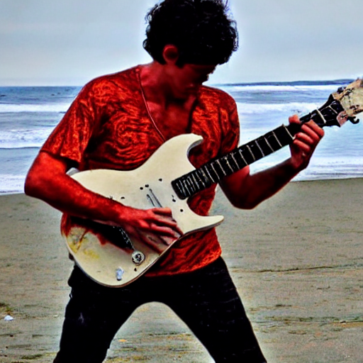

# Stable Diffusion Dockerized Tool

A custom tool utilizing the stable diffusion repository with swappable models. This tool is managed and exposed to public use via an API and scheduler implemented through Celery, Redis and Flask. These systems are then managed by docker compose allowing quick and easy install to any system.

## How to install and run
### Build

There are currently 3 buildable versions of the tool:
- **CPU**
    - This version deploys a version of the tool capable of running on CPUs. Expected inference time will be around ~20 minutes per image depending on CPU power.
- **GPU**
    - This is the standard Stable Diffusion tool. Expected image generation time can be from 20-30 seconds per image. However, this can utilize up to 11 GB of VRAM for a single inference process and is best for either extremely powerful machines or one-off/light image generation.
- **GPU Optimized**
    - This is an optimized version of the Stable Diffusion of the repo. Expected image generation time can vary from 30 seconds to 1 minute 20 seconds depending on machine power. It's slightly slower than the standard repo but only utilizes around 2-4 GB of VRAM, which means you can have 3-6 times more images being generated in parallel. This is preferred for large scale image generation.

These can be built by:
```bash
docker-compose -f docker-compose.build-<type>.yml build
```
e.x.
```bash
docker-compose -f docker-compose.build-gpu-optimized.yml build
```

### Launch

The tool can be launched in a variety of ways:

*Launch and attach to logs*
```bash
docker-compose -f docker-compose.build-gpu-optimized.yml up
```
This method will connect your terminal to the log output of each container/process. The terminal will receive and display logs. The tool can be shutdown via ctrl-c or command-c.

*Launch and do not attach to logs*
```bash
docker-compose -f docker-compose.build-gpu-optimized.yml up -d
```
This method will simply start the tool in the background. It can be later shutdown via:
```bash
docker-compose down
```

*Build and launch directly*
```
docker-compose -f docker-compose.yml -f docker-compose.development.yml up --build
```
If you have not built the tool as in the previous step, or wish to rebuild the current tool to take in any update changes, then you'll run this. Be sure to clean up any old, unused build by running:
```bash
docker system prune
```

## How to use
### Calling the API
Once running, the API/Flask container will expose the API endpoints on port 5001. The currently available endpoints are:

- POST:generate
    - This endpoint takes in a JSON body through a POST request and if valid, stores the request within a Redis queue. When a Celery worker becomes free, it will pick up this task, begin steps to generate an image from it and return a *task ID*.
- POST:img2img
    - This endpoint takes in a JSON body through a POST request __along with a base64 encoded image__ and if valid, stores the request within a Redis queue. When a Celery worker becomes free, it will pick up this task, begin steps to generate an image from it and return a *task ID*.
- GET:status/<*taskID*>
    - This endpoint takes a taskID and returns the current state of it, along side any meta data relevant to it's current state.
    - When the task is finished, depending on your base64 setting, this endpoint will either return a base64 encoded image along with metadata to reconstruct it __or__ it will directly return an image.
- GET:recent
    - This endpoint returns the past 10 successfully generated image links.

These requests can be made through curl, Postman or any other HTTP tool.

### Formatting the request
Currently, the request varies slightly from the GPU optimized version and the CPU/GPU standard version (however, the CPU/GPU standard version requests are the same format). The schemas to use can be found in /api/templates/ with an example for the GPU optimized being:
**Text2Img/generate**
```json
{
    "type": "optimized",
    "prompt": "a photo of a red scaley ((dragon)) playing a ((guitar)) on a beach, natural light",
    "negative_prompt": "human, cartoon",
    "outdir": "outputs/txt2img-samples",
    "skip_grid": true,
    "skip_save": false,
    "api_key": "lksalsdfjliadfds",
    "return_base64": false,
    "synchronous_request": false,
    "ddim_steps": 20,
    "fixed_code": false,
    "ddim_eta": 0.0,
    "n_iter": 1,
    "H": 512,
    "W": 512,
    "C": 4,
    "f": 8,
    "n_samples": 1,
    "n_rows": 0,
    "scale": 7.5,
    "device": "cuda",
    "from-file": false,
    "config": "scripts/v1-inference.yaml",
    "ckpt": "default",
    "seed": 42,
    "unet_bs": 1,
    "turbo": true,
    "format": "png",
    "sampler": "ddim",
    "precision": "autocast"
}
```

**img2img**
```json
{
    "type": "optimized",
    "prompt": "a photo of a red scaley ((dragon)) playing a ((guitar)) on a beach, natural light",
    "negative_prompt": "human, cartoon",
    "init_img": "iVBORw0KGgoAAAANSUhEUgAAABgAAAAYCAYAAADgdz34AAAABHNCSVQICAgIfAhkiAAAAAlwSFlzAAAApgAAAKYB3X3/OAAAABl0RVh0U29mdHdhcmUAd3d3Lmlua3NjYXBlLm9yZ5vuPBoAAANCSURBVEiJtZZPbBtFFMZ/M7ubXdtdb1xSFyeilBapySVU8h8OoFaooFSqiihIVIpQBKci6KEg9Q6H9kovIHoCIVQJJCKE1ENFjnAgcaSGC6rEnxBwA04Tx43t2FnvDAfjkNibxgHxnWb2e/u992bee7tCa00YFsffekFY+nUzFtjW0LrvjRXrCDIAaPLlW0nHL0SsZtVoaF98mLrx3pdhOqLtYPHChahZcYYO7KvPFxvRl5XPp1sN3adWiD1ZAqD6XYK1b/dvE5IWryTt2udLFedwc1+9kLp+vbbpoDh+6TklxBeAi9TL0taeWpdmZzQDry0AcO+jQ12RyohqqoYoo8RDwJrU+qXkjWtfi8Xxt58BdQuwQs9qC/afLwCw8tnQbqYAPsgxE1S6F3EAIXux2oQFKm0ihMsOF71dHYx+f3NND68ghCu1YIoePPQN1pGRABkJ6Bus96CutRZMydTl+TvuiRW1m3n0eDl0vRPcEysqdXn+jsQPsrHMquGeXEaY4Yk4wxWcY5V/9scqOMOVUFthatyTy8QyqwZ+kDURKoMWxNKr2EeqVKcTNOajqKoBgOE28U4tdQl5p5bwCw7BWquaZSzAPlwjlithJtp3pTImSqQRrb2Z8PHGigD4RZuNX6JYj6wj7O4TFLbCO/Mn/m8R+h6rYSUb3ekokRY6f/YukArN979jcW+V/S8g0eT/N3VN3kTqWbQ428m9/8k0P/1aIhF36PccEl6EhOcAUCrXKZXXWS3XKd2vc/TRBG9O5ELC17MmWubD2nKhUKZa26Ba2+D3P+4/MNCFwg59oWVeYhkzgN/JDR8deKBoD7Y+ljEjGZ0sosXVTvbc6RHirr2reNy1OXd6pJsQ+gqjk8VWFYmHrwBzW/n+uMPFiRwHB2I7ih8ciHFxIkd/3Omk5tCDV1t+2nNu5sxxpDFNx+huNhVT3/zMDz8usXC3ddaHBj1GHj/As08fwTS7Kt1HBTmyN29vdwAw+/wbwLVOJ3uAD1wi/dUH7Qei66PfyuRj4Ik9is+hglfbkbfR3cnZm7chlUWLdwmprtCohX4HUtlOcQjLYCu+fzGJH2QRKvP3UNz8bWk1qMxjGTOMThZ3kvgLI5AzFfo379UAAAAASUVORK5CYII=",
    "upscale": false,
    "post_upscale": false,
    "denoising_strength": 0.5,
    "noise_multiplier": 1.0,
    "outdir": "outputs/txt2img-samples",
    "skip_grid": true,
    "skip_save": false,
    "api_key": "lksalsdfjliadfds",
    "return_base64": false,
    "synchronous_request": false,
    "ddim_steps": 50,
    "fixed_code": false,
    "ddim_eta": 0.0,
    "n_iter": 2,
    "H": 512,
    "W": 512,
    "C": 4,
    "f": 8,
    "n_samples": 1,
    "n_rows": 0,
    "scale": 7.5,
    "device": "cuda",
    "from-file": false,
    "config": "scripts/v1-inference.yaml",
    "ckpt": {"sd14": "model.ckpt", "sd21": "model2.ckpt", "sd15": "model15.ckpt"},
    "seed": 42,
    "unet_bs": 1,
    "turbo": true,
    "format": "png",
    "sampler": "plms",
    "precision": "autocast"
}

```

### Parameter Definitions
- type: ["standard", "optimized"]
    - This parameter alerts the API whether or are using the optimized or standard Stable Diffusion (SD) repo. This setting should always be set to reflect the version of tool you built.
- prompt: *string*
    - The prompt you'd like the model to generate. () parentheses can be used to emphasize a specific or group of words. More parentheses will add more emphasis to that specific word or phrase. Brackets on the other hand [] are used to *reduce* the importance of a word or phrase. (See the Attention Examples section for further info.)
    - Prompts can also be weighted to put relative emphasis on certain words. eg. --prompt tabby cat:0.25 white duck:0.75 hybrid. The number followed by the colon represents the weight given to the words before the colon. The weights can be both fractions or integers. The values should usually all add up to 1 or 100

- negative_prompt: *string*
    - This works similar to the prompt parameter, however, it tells the model to actively remove features associated with this input. (e.x. "wings, fog, blue" will attempt to remove any wings, fog or the color blue from your original prompt.)
- (img2img only) init_img: *string*
    - A base64 encoded image without the metadata (i.e. "data:image/png;bas64,<\base_64_img>")
- (img2img only) denoising_strength: *decimal* - 0 < x <= 1.0
    - The strength of the new image replacing the original image. 0.01 being the original image, 1 being a completely new image.
- (img2img only) upscale: *boolean*
    - Decide whether or not to upscale an image before processing it (e.g. 512 -> 1024 -> 512 -> processing). This allows for a much higher image quality to be used in the generation process.
- (img2img only) post_upscale: *boolean*
    - Same as the upscale feature, however this is applied *after* processing to try and increase the apparent resolution.
- (img2img only) noise_multiplier: *decimal*
    - A decimal value used to modify the "noise" used to augment the image.
- outdir: *string*
    - The output path for image generations. The standard path will be "/queue/stable-diffusion-repo/" The path specified in outdir will be placed in this directory, the necessary folders will be created if they don't currently exist
- skip_grid: *boolean*
    - If false, this will combine all images within a single request into a single image. Helpful for quickly viewing synchronous directly sent images.
- skip_save: *boolean*
    - Do not save individual samples; will only be needed once the images are needed to be placed in an external storage medium.
- api_key: *string*
    - The api_key required to start an event or view recent images. Currently defaulted to a dummy: lksalsdfjliadfds
- return_base64: *boolean*
    - Tells the job whether to return a base64 encoded version of the image along with metadata to reconstruct it or to directly send the image.
    - If false and n_iter or n_samples > 1, then the tool will save the other base64 images, but only be able to send 1. For frontend purposes, you'll most likely want this as true.
- synchronous_request: *boolean*
    - Tells the tool whether to immediately return a link to track an image's progress or to lock the client until the request is complete
- ddim_steps: *positive integer*
    - number of sampling steps to take per image (usually around 50 steps is ideal)
- fixed_code: *boolean*
    - if enabled, uses the same starting code across samples (Most notable effect is a constant seed value)
- ddim_eta: *positive decimal*
    - ddim eta (eta=0.0 corresponds to deterministic sampling)
- n_iter: *positive integer* (>=1)
    - Create n_iter number of images in separate steps
- H: *int* (<=512)
    - Image height in pixels
- W: *int* (<=512)
    - Image width in pixels
- C *int*
    - latent channels
- f: *int*
    - downsampling factor
- n_samples: *int* (>=1)
    - how many samples to produce during each iteration aka. batch size. This differs from n_iter in that it will produce and hold n_samples of images in memory at a time, while images produced during n_iter are off-loaded and saved between each iteration.
- n_rows: *int* (default is n_samples)
    - If grid is true, number of rows of images in each grid output
- scale: *decimal*
    - unconditional guidance scale. A weight associated with how much the model adheres to your prompt.
        - 7.5: The default value. The model balances your prompt with it's own freedom to interpet
        - 1-3: The model will only use your prompt as a light suggestion.
        - 0: The model won't utilize the prompt
        - <0: The model will actively create images that do not fit your prompt
        - 10-13: The model will more strongly follow your prompt
        - 13-16: The model will deviate very little from the prompt
        - 16-20: The model will take no liberties and *only* create an image from information taken from your prompt
        - \>20: Tends to cause duplication as the model uses words from your prompt to also create a background and fill in void spaces
- device: *string*
    - specify GPU (cuda/cuda:0/cuda:1/...)
- from-file: *string*
    - If specified, loads prompts from a file. Can be turned off by setting an empty string or by setting the value as *false*
- config: *string*
    - The config file used to contruct the model.
        - Choices for optimized are: 
            - "scripts/v1-inference.yaml"
            - "scripts/v2-inference.yaml"
            - "scripts/v2-inference-v.yaml"
        - Default for standard GPU/CPU is: "configs/stable-diffusion/v1-inference.yaml"
- ckpt: ["sd14", "sd21", "sd21v]
    - The model to use for image generation.
        - sd14/sd1.4: The default Stable Diffusion model.
        - sd21/sd2.1: The SD 2.1 model.
        - sd21v/sd2.1v: The SD 2.1 v model trained on 768 HxW
- seed: *int*
    - A value used to *randomize* the image generation. The same prompt with same parameters and the same seed will always produce the same image. Can be used to replicate other users' generations, modify a single generation you've created or to validate different models with the same settings.
    - Can be set as null or false to simply generate a random seed.
- unet_bs: *decimal*
    - Batch size for the unet model. Takes up a lot of extra RAM for very little improvement in inference time. unet_bs > 1 is not recommended!
    - Should generally be a multiple of 2x(n_samples)
- turbo: *boolean*
    - Increases inference speed at the cost of extra VRAM usage.
    - Using this argument increases the inference speed by using around 700MB of extra GPU VRAM. It is especially effective when generating a small batch of images (~ 1 to 4) images. It takes under 20 seconds for txt2img and 15 seconds for img2img (on an RTX 2060, excluding the time to load the model). Use it on larger batch sizes if GPU VRAM available.
- format: ["png", "jpg"]
    - Output image format. The default output format is png. While png is lossless, it takes up a lot of space (unless large portions of the image happen to be a single colour). Use lossy jpg to get smaller image file sizes.
- sampler: ["ddim", "plms",...]
    - Generating images require differential equations to be solved. Samplers are essentially the approach taken to solve these equations. A high-level comparison of these can be found [here](https://old.reddit.com/r/StableDiffusion/comments/x41n87/how_to_get_images_that_dont_suck_a/). You can also view the "sampler comparison" section to see how the samplers differ when used on the same prompt.
    - Extra samplers (Name, JSON Key):
```python
    ('Euler a', ['k_euler_a', 'k_euler_ancestral']),
    ('Euler', ['k_euler']),
    ('LMS', ['k_lms']),
    ('Heun', ['k_heun']),
    ('DPM2', ['k_dpm_2']),
    ('DPM2 a', ['k_dpm_2_a']),
    ('DPM++ 2S a', ['k_dpmpp_2s_a', 'dpm2s_a']),
    ('DPM++ 2M', ['k_dpmpp_2m']),
    ('DPM++ SDE', ['k_dpmpp_sde']),
    ('DPM fast', ['k_dpm_fast']),
    ('DPM adaptive', ['k_dpm_ad']),
    ('LMS Karras', ['k_lms_ka']),
    ('DPM2 Karras', ['k_dpm_2_ka']),
    ('DPM2 a Karras', ['k_dpm_2_a_ka']),
    ('DPM++ 2S a Karras', ['k_dpmpp_2s_a_ka']),
    ('DPM++ 2M Karras', ['k_dpmpp_2m_ka']),
    ('DPM++ SDE Karras', ['k_dpmpp_sde_ka']),
```

- precision: ["mixed", "full", "autocast"]
    - If you don't have a GPU with tensor cores (any GTX 10 series card), you may not be able use mixed precision. Use precision: "full".


### Attention Examples
Here we'll show off some generations with the sampe prompt and parameters, but different "emphasis" enacted within the prompt:

prompt: `a red scaley dragon playing a guitar on a beach`
<br/>

prompt: `a red scaley (dragon) playing a guitar on a beach`
<br/>

prompt: `a (red) scaley (((dragon))) playing a ((guitar)) on a [beach]`
<br/>

prompt: `a (((red))) scaley [dragon] playing a [guitar] on a [beach]`
<br/>

### Sampler Comparison


## Other
### Scaling
This system currently scales by itself to use as many CPUs as you currently have. One worker is capable of generating n number of images in parallel where n is represented by the number of cores you have. This is generally the most efficient way of parallelizing the work stream.

One possible issue that may arise may be related to a worker not separating processes well enough. So if you switch models too much within a short amount of time, the worker might attempt to deallocate a model that a previous process is utilizing. If this occurs you can create separate workers which each partition their own environment, VRAM and CPU. The only issue with this is that reusable information may be loaded into x amount of workers, straining your memory.


To add more workers:
```bash
docker-compose up -f <file> -d --scale worker=5 --no-recreate
```
Where 5 can be set up to the number of CPUs you have. CPUs will be split between these workers if there are more CPUs than workers.

### Downloading Results
Currently, results are saved within the worker that generates them. To download these results to your local machine you can follow these steps:
- Copy the ID of the worker container you are targeting. `docker ps` to pull up all active containers
- Use this ID in `docker cp <container_ID>:/queue/stable-diffusion-repo/outputs/. ~/sd-images`

This will download all images from *that* worker into the directory on your machine specified in the end. This directory will be automatically created if it doesn't exist.

If you are scaling by splitting your CPUs among multiple workers, you'll need to run this for each worker.
# personal-diffusion
